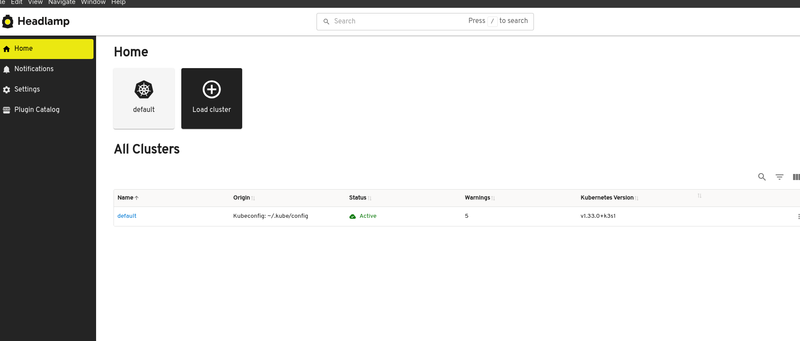
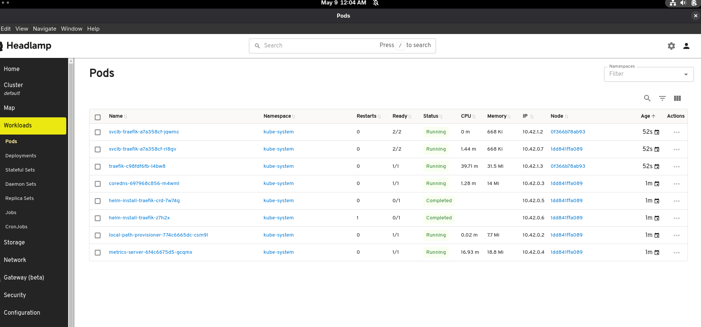

# 🧪 K3s + Podman + macvlan + Headlamp Setup

This project runs a local K3s cluster in Podman containers using a macvlan network, allowing you to expose your Kubernetes API and services directly on your LAN. It's great for local development, testing, or homelab setups.

---

## 📦 Prerequisites

You must first create a **macvlan network** that connects your containers to your LAN.

> 🔧 I'm using my laptop setup, that is done automatically via Ansible:
> [▶️ macvlan setup task](https://github.com/josephaw1022/LaptopConfiguration/blob/main/fedora-41/automated-setup/roles/podman/tasks/macvlan.yml)

---

## 🚀 Quick Start

### 🔍 View available Makefile targets

```bash
make
```

### 🛠 Start the K3s + Pi-hole cluster

```bash
make up
```

### 📄 Replace your kubeconfig with the one from K3s

```bash
make replace-kubeconfig
```

### 🔌 Enable host access to the macvlan subnet

```bash
make setup-host-macvlan
```

---

## 🌐 Accessing the Cluster

Once setup is complete, open **Headlamp** in your browser. You should see your K3s cluster running on the macvlan network.

### 📸 Cluster view:



### 📦 Pods view:



---

## 🧹 Cleanup

To tear everything down:

```bash
make down
make cleanup-host-macvlan
make clean
```
